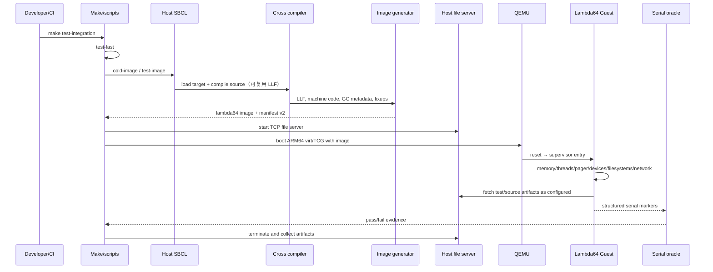

# 构建与启动生命周期

## 构建阶段

1. **准备依赖**：递归 submodule、宿主 Lisp 系统和临时构建配置。
2. **装载编译器**：`Lambda64/compiler/cross.lisp`、`Lambda64/compiler/cross-boot.lisp` 和 `Lambda64/tools/cold-generator2/cold-generator.lisp` 建立宿主/目标环境。
3. **编译目标源码**：前端 AST → 优化 → 共享后端 → ARM64 后端 → LLF 命令/对象流。
4. **生成镜像**：`Lambda64/tools/cold-generator2/` 校验目标、写入机器码/对象/GC 信息/fixup。
5. **写入来源证明**：`scripts/write-test-manifest.sh` 记录仓库提交、源码树和镜像摘要。

相关入口：根 `Makefile` 的 `cold-image`、`test-image`、`test-fast` 与 `test-integration` 目标。

## Guest 启动阶段

`Lambda64/supervisor/entry.lisp` 是关键启动入口，随后初始化平台、内存、线程/调度、分页器和设备。IPL 阶段位于 `Lambda64/ipl.lisp`，负责加载更高层系统、网络、可选调试服务和桌面。

启动成功不等于所有子系统正确：串口 oracle 只能判断已定义的 fatal marker、Guest 测试协议和超时条件。

## 测试生命周期

- `scripts/run-local-test-matrix.sh` 管理 positive/negative 场景、结果目录和报告。
- `Lambda64/tools/ci/run-arm64-smoke.sh` 启动 QEMU、限制时长并收集串口。
- `Lambda64/tests/guest/runner.lisp` 定义 Guest 测试目录。
- `Lambda64/tools/ci/assert-serial-log.sh` 将串口文本转换为测试判定。

## 可复现性边界

当前 manifest 能证明“使用了哪份源码和镜像”，但不能证明镜像按位可复现：镜像 UUID 使用随机值，部分表通过未排序 `maphash` 输出，缓存键也未覆盖所有输入。`make test-integration` 也不会自动删除 LLF。因此文档使用“来源可追踪”，不使用“bit-reproducible”承诺。

## 已知维护风险

- ASDF、cold generator 和 IPL 各自维护部分加载顺序。
- 临时配置覆盖不是并发安全的。
- 构建和目标选择依赖全局状态。
- 大镜像导致冷构建和复制成本高。
- 部分错误路径使用 `ignore-errors`，可能丢失根因。
