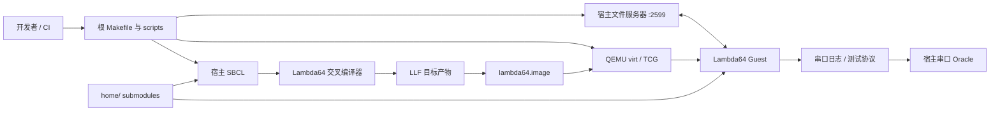

# 系统上下文与信任边界

## 边界说明

### 宿主构建边界

根 `Makefile`、`scripts/` 与宿主 SBCL 构成可信构建面。它们读取本地源码、submodule 和临时配置，产出镜像、manifest 与测试结果。当前临时配置通过覆盖/恢复文件实现（`scripts/with-temporary-config.sh`），并发构建存在竞争风险。

### 目标镜像边界

`Lambda64/tools/cold-generator2/` 将编译后的目标对象、GC 信息和 fixup 写入镜像。当前 LLF 缓存主要使用源文件 mtime 判定，未完整覆盖编译器、宏、目标配置变化，因此不能把“缓存命中”视为语义等价保证。

### Guest 边界

QEMU `virt` + TCG 是当前确定性集成目标。Guest 内部包括 Supervisor、运行时、驱动、文件系统、网络、GUI 与应用。物理硬件、加速虚拟化和像素级 GUI 不在当前自动化证明范围。

### 网络信任边界

宿主文件服务器是目前最重要的安全边界：它默认绑定 `0.0.0.0`，允许远端请求文件操作，并通过 Lisp reader 读取网络输入。修复前，测试环境必须视为只适合可信、隔离网络。详见 [宿主文件服务器](../security/host-file-server.md)。

Guest Swank 服务也监听所有 Guest 接口（`Lambda64/ipl.lisp`）且没有协议级认证。根 `Makefile` 的手工 QEMU 目标使用 loopback hostfwd；其他 runner 可能没有 4005 hostfwd，物理/桥接网络仍可能直接暴露 Guest 服务，不能把宿主转发配置当作认证边界。

## 外部依赖

- 宿主：SBCL、QEMU、POSIX shell、Git。
- 源依赖：`home/` 下递归 submodules，构建图由 ASDF、cold generator 和 IPL 多处共同定义。
- 运行依赖：QEMU virt 平台、VirtIO 设备、可选网络/宿主文件服务。

## 架构风险摘要

| 风险 | 影响 | 当前控制 |
| --- | --- | --- |
| 多个加载图事实源 | 顺序漂移、warning、不可复现 | 串行构建与集成测试 |
| 编译/目标全局状态 | 不可重入、难并行、多目标污染 | 单目标串行流程 |
| LLF 缓存键不完整 | 使用过期编译产物 | `make clean` 后重建可规避；默认集成目标不清理 LLF |
| 宿主文件服务器无安全边界 | 宿主任意代码/文件风险 | 仅应在可信隔离环境运行 |
| Guest 测试覆盖偏集成 | 回归定位慢 | fast 契约测试 + serial oracle |
